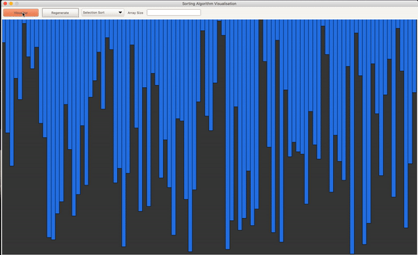
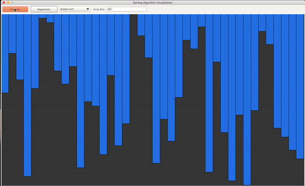
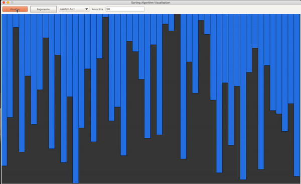
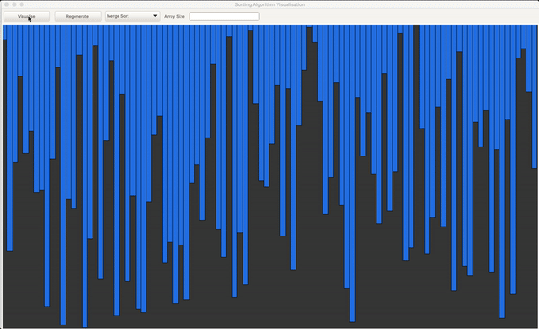
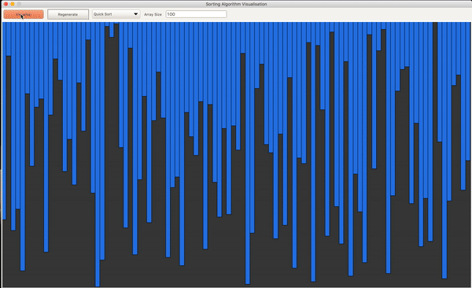

# Sorting Algorithms

Visualising various sorting algorithms using Python and Tkinter. Algorithms include selection sort, bubble sort, insertion sort, merge sort and quick sort.

## Selection Sort

Selection sort is an in-place comparison sorting algorithm. It has an O(n²) timc complexity, which makes it inefficient on large lists, and generally performs worse than the similar insertion sort. Wikipedia

    Worst complexity: n^2
    Average complexity: n^2
    Best complexity: n^2
    Space complexity: 1
    Method: Selection
    Stable: No
    Class: Comparison sort

## Bubble Sort

Bubble sort, sometimes referred to as sinking sort, is a simple sorting algorithm that repeatedly steps through the list, compares adjacent elements and swaps them if they are in the wrong order. The pass through the list is repeated until the list is sorted. Wikipedia

    Worst complexity: n^2
    Average complexity: n^2
    Best complexity: n
    Space complexity: 1
    Method: Exchanging
    Stable: Yes
    Class: Comparison sort

## Insertion Sort

Insertion sort is a simple sorting algorithm that builds the final sorted array one item at a time. It is much less efficient on large lists than more advanced algorithms such as quicksort, heapsort, or merge sort. Wikipedia

    Worst complexity: n^2
    Average complexity: n^2
    Best complexity: n
    Space complexity: 1
    Method: Insertion
    Stable: Yes
    Class: Comparison sort

 

## Merge Sort

Merge sort is an efficient, general-purpose, comparison-based sorting algorithm. Most implementations produce a stable sort, which means that the order of equal elements is the same in the input and output. Merge sort is a divide and conquer algorithm. Wikipedia

    Worst complexity: n*log(n)
    Average complexity: n*log(n)
    Best complexity: n*log(n)
    Space complexity: n
    Method: Merging
    Stable: Yes

## Quick Sort

Quicksort is an efficient sorting algorithm. Developed by British computer scientist Tony Hoare in 1959 and published in 1961, it is still a commonly used algorithm for sorting. When implemented well, it can be about two or three times faster than its main competitors, merge sort and heapsort. Wikipedia

    Worst complexity: n^2
    Average complexity: n*log(n)
    Best complexity: n*log(n)
    Method: Partitioning
    Stable: No
    Class: Comparison sort
    

